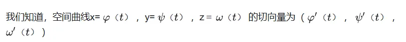
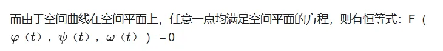
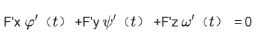
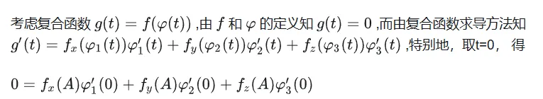

# 偏导数组成的向量组 是 切平面的法线
- 从向量坐标角度理解$f(\varphi(t))$
  - 与曲面上任取一条过该点的空间曲线的切线都垂直。而如何表示这个垂直呢：向量数量积＝0
    - 
      - 
      - 对方程求导得：
        - 
  - 即
    - 
    - $g'(t)=f_x(\varphi_1(t))\varphi_1'(t)+f_y(\varphi_2(t))\varphi_2'(t)+f_z(\varphi_3(t))\varphi_3'(t)$