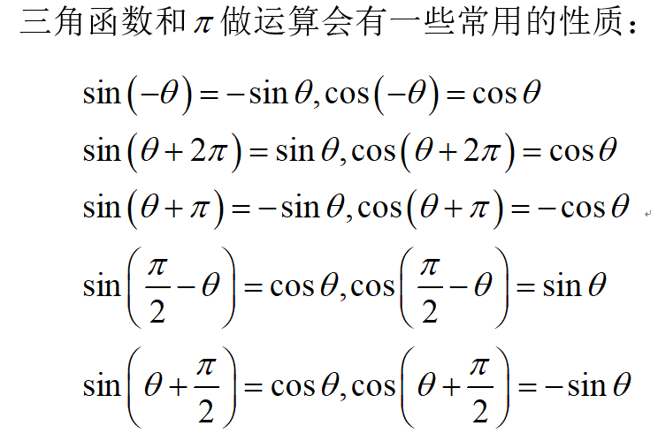

## 0-弧长公式
> “求全长”/"求弧长":
  指计算一个曲线在给定区间内的弧长

### 0 弧长公式 
设曲线由函数 $y = f(x)$ 在区间 $[a, b]$ 上描述，其中 $f(x)$ 在 $[a, b]$ 上连续，且其导数 $f'(x)$ 在 $[a, b]$ 上存在且连续。那么，从 $x = a$ 到 $x = b$ 的弧长 $L$ 可以通过以下公式计算：
$$L = \int_{a}^{b} \sqrt{1 + [f'(x)]^2} \, dx$$
这个公式是基于弧长微元的概念。在直角坐标系中，如果考虑曲线上的一个微小段 $\Delta s$，其长度可以近似为：
$$\Delta s \approx \sqrt{\Delta x^2 + \Delta y^2}$$
由于 $\Delta y = f'(x) \Delta x$，当 $\Delta x$ 趋于 0 时，我们可以得到弧长微元的精确表达式：
$$ds = \sqrt{1 + [f'(x)]^2} \, dx$$
因此，整个弧长就是上述微元的积分。
如果曲线由参数方程 $x = x(t)$ 和 $y = y(t)$ 描述，其中 $t$ 在区间 $[t_1, t_2]$ 上变化，那么弧长公式变为：
$$L = \int_{t_1}^{t_2} \sqrt{[x'(t)]^2 + [y'(t)]^2} \, dt$$
- - -
### add 牛顿-莱布尼茨公式
- 
$$\int_{a}^{b} f(x) \, dx = F(b) - F(a)$$
其中 $F(x)$ 是 $f(x)$ 的原函数。

- 
 $$ F'(x) = f(x) $$
- - -
### 1 定积分的导数
> 按基本的区间带入算，但各项 要乘以端点的 导数

$$\left[\color{grey}\int_{\varphi_1(x)}^{\varphi_2(x)}f(t)dt\right]'=\frac{d}{dx}\int_{\color{green}\varphi_1(x)}^{\color{blue}\varphi_2(x)}f(t)dt={f\left[\varphi_2(x)\right]\cdot\color{blue}\varphi_2'(x)}-f\left[\varphi_1(x)\right]\cdot\color{green}\varphi_1'(x)$$

- - -
## 1-特殊三角函数值

| 函数值/角度 | 0| $\frac{1}{6}\pi$   | $\frac{1}{4}\pi$   | $\frac{1}{3}\pi$   | $\frac{1}{2}\pi$   | $\pi$|
|-------------|--------------------|--------------------|--------------------|--------------------|--------------------|--------------------|
| sin         | 0| $\frac{1}{2}$      | $\frac{\sqrt{2}}{2}$ | $\frac{\sqrt{3}}{2}$ | 1| 0|
| cos         | 1| $\frac{\sqrt{3}}{2}$ | $\frac{\sqrt{2}}{2}$ | $\frac{1}{2}$      | 0| -1                 |
| tan         | 0| $\frac{\sqrt{3}}{3}$ | 1| $\sqrt{3}$         | 不存在             | 0|

请注意，当角度为$\frac{1}{2}\pi$时，tan的值是无穷大，通常表示为不存在。

## 2-三角恒等变换

0. 三角函数图像&两角公式 (推导和差化积)
  https://blog.csdn.net/Gou_Hailong/article/details/122830552
     - 推导
    
     - 其他基础
       - 公式
         - 
       - 图像
         - 
         - 
1. 倍角公式：
  ○ $\sin 2A = 2\sin A \cos A$
  ○ $\cos 2A = \cos^2 A - \sin^2 A = 2\cos^2 A - 1 = 1 - 2\sin^2 A$
  ○ $\tan 2A = \frac{2\tan A}{1 - \tan^2 A}$
● 半角公式：
  ○ $\sin\frac{A}{2} = \pm\sqrt{\frac{1 - \cos A}{2}}$← 倍角公式推导
  ○ $\cos\frac{A}{2} = \pm\sqrt{\frac{1 + \cos A}{2}}$
  ○ $\tan\frac{A}{2} = \pm\sqrt{\frac{1 - \cos A}{1 + \cos A}} = \frac{\sin A}{1 + \cos A}$
1. 和差化积公式：
  ○ $\sin A \pm \sin B = 2\sin\left(\frac{A \pm B}{2}\right)\cos\left(\frac{A \mp B}{2}\right)$
  ○ $\cos A \pm \cos B = 2\cos\left(\frac{A \pm B}{2}\right)\cos\left(\frac{A \mp B}{2}\right)$
1. 积化和差公式：
  ○ $\sin A \sin B = \frac{1}{2}[\cos(A - B) - \cos(A + B)]$
  ○ $\cos A \cos B = \frac{1}{2}[\cos(A - B) + \cos(A + B)]$
  ○ $\sin A \cos B = \frac{1}{2}[\sin(A + B) + \sin(A - B)]$

  
参考文章

  https://blog.csdn.net/Gou_Hailong/article/details/122830552
  https://blog.csdn.net/Gou_Hailong/article/details/122830552 ←和差化积 推导

