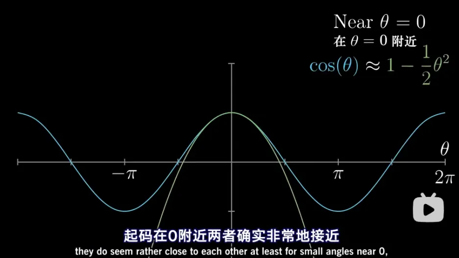
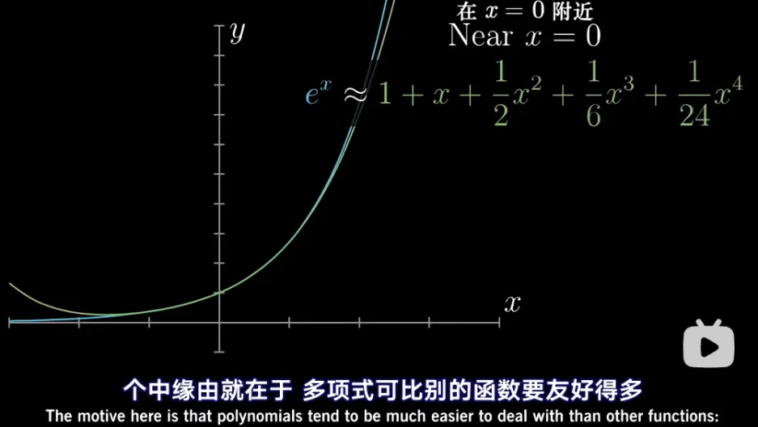

# (泰勒)级数
拟合曲线，近似研究
- $\cos\theta$
  -  
  
- $e^x$
  -  

# 级数(series) 与 和函数(Summation Function)
- 级数是一个无限求和的概念
- 和**函数**是一个特定类型的函数，它计算有限序列的和
  - (和**函数** 的本质 还是一个函数)
# 泰勒展开 与 麦克劳林 | 推导
## 泰勒公式 与 麦克劳林公式
麦克劳林公式是泰勒公式的一种特殊情况。泰勒公式用于描述一个函数在某一点的邻域内的值，可以展开成该点处的无限级数。麦克劳林公式是泰勒公式在展开点为0的特殊情况。
泰勒公式的一般形式是：
$$f(x) = f(a) + f'(a)(x-a) + \frac{f''(a)}{2!}(x-a)^2 + \cdots + \frac{f^{(n)}(a)}{n!}(x-a)^n + R_n(x)$$  
其中，$f^{(n)}(a)$ 是函数 $f(x)$ 在 $x=a$ 点的第 $n$ 阶导数，$n!$ 是 $n$ 的阶乘，$R_n(x)$ 是余项，表示公式的误差。
当 $a=0$ 时，泰勒公式就变成了麦克劳林公式：
$$f(x) = f(0) + f'(0)x + \frac{f''(0)}{2!}x^2 + \cdots + \frac{f^{(n)}(0)}{n!}x^n + R_n(x)$$  
因此，可以说麦克劳林公式是泰勒公式在 $a=0$ 时的特例。两者都用于函数的局部近似，但麦克劳林公式更常用于那些在原点附近容易计算的函数。
## 推导：
泰勒公式是数学分析中的一个重要工具，它可以将一个在某点附近可导的函数展开成幂级数。这个公式得名于英国数学家布鲁克·泰勒，他在1712年发表了关于这个公式的工作。然而，泰勒公式的概念实际上是由詹姆斯·伯努利在1694年首次提出的。
泰勒公式的推导基于函数在某点的导数信息来近似该函数。下面是泰勒公式的推导过程：
1. 泰勒多项式的**概念**：
考虑一个在点 $a$ 可导的函数 $f(x)$。我们可以用函数在 $a$ 点的导数来近似 $f(x)$。函数在 $a$ 点的一阶泰勒多项式是：
$$T_1(x) = f(a) + f'(a)(x - a)$$
   这个多项式包含了函数在 $a$ 点的值和斜率。
  a. **二阶**泰勒多项式：
   如果函数在 $a$ 点可导两次，我们可以进一步利用二阶导数来改进近似。二阶泰勒多项式是：
$$ T_2(x) = f(a) + f'(a)(x - a) + \frac{f''(a)}{2!}(x - a)^2$$
   这里，$\frac{f''(a)}{2!}$ 是函数在 $a$ 点的曲率。
  b. 推广到更**高阶**：
   类似地，我们可以继续添加更高阶的导数来得到更高阶的泰勒多项式。$n$ 阶泰勒多项式是：
$$T_n(x) = f(a) + f'(a)(x - a) + \frac{f''(a)}{2!}(x - a)^2 + \cdots + \frac{f^{(n)}(a)}{n!}(x - a)^n$$
- 泰勒公式的极限情况：
当 $n$ 趋向于无穷大时，如果函数 $f(x)$ 在点 $a$ 附近可以表示为无限级数，我们得到泰勒公式：
$$f(x) = f(a) + f'(a)(x - a) + \frac{f''(a)}{2!}(x - a)^2 + \cdots + \frac{f^{(n)}(a)}{n!}(x - a)^n + \cdots$$
   这个级数称为泰勒级数。
- 收敛性问题：
   并非所有函数都可以在所有点附近展开成泰勒级数。泰勒级数的收敛性取决于函数的性质和展开点的选择。

泰勒公式在物理学、工程学、经济学等多个领域都有广泛的应用，因为它提供了一种将复杂函数简化为多项式的方法，从而便于分析和计算。

## 使用更高阶导数 进行 近似 的意义
在泰勒公式的推导过程中，使用更高阶导数进行近似的意义在于更精确地捕捉函数的局部性质。每一阶导数都提供了函数在该点附近行为的额外信息：
1. 一阶导数：提供函数在某点的斜率，即函数在该点的变化率。一阶泰勒多项式（即线性近似）只能描述函数在该点的线性变化。
2. 二阶导数：描述函数的曲率，即函数变化的加速度。二阶泰勒多项式可以描述函数的局部弯曲，提供比一阶多项式更准确的近似。
3. 更高阶导数：提供关于函数局部行为更细致的信息。例如，三阶导数描述了曲率的改变率，四阶导数描述了曲率改变率的改变率，依此类推。更高阶的泰勒多项式能够更好地模拟原函数的局部非线性特征。
   
通过包含更高阶的导数，泰勒多项式能更好地模拟原函数的复杂行为，尤其是在函数变化较为剧烈或者具有高度非线性的区域。理论上，如果函数在某点具有所有阶的导数，那么泰勒级数可以无限逼近该点的函数值，只要级数在该区域内收敛。

在实际应用中，通常只需要计算到前几阶导数，因为更高阶的导数往往对近似的影响较小，或者在实际问题中不易计算。选择合适的泰勒多项式阶数是一个平衡精确度和计算复杂性的过程。