## 泰勒展开
- - -
> 将多种类型的函数 → 统一的多项式函数

only掌握十项函数的泰勒展开
### 0 一般形式
在数学中，泰勒展开是一种将函数表示成 <u>无限项的和</u>的方法，这些项是函数在某一点的导数的多项式。对于函数 \( f(x) \)，在点 \( a \) 的泰勒展开式一般形式为：
\[ f(x) = f(a) + f'(a)(x-a) + \frac{f''(a)}{2!}(x-a)^2 + \frac{f'''(a)}{3!}(x-a)^3 + \cdots \]
对于 \( x \) 和 \( x^2 \)，我们可以考虑在 \( a = 0 \) 处的泰勒展开，即麦克劳林展开。由于 \( x \) 和 \( x^2 \) 都是多项式函数，它们的泰勒展开实际上就是它们自身，因为它们在任何点的导数都和原函数一样或者为零。
1. **\( x \) 的泰勒展开：**
   \( x \) 在 \( x = 0 \) 处的泰勒展开非常简单，因为它本身就是它的泰勒展开式：
   \[ x = x \]
   这是因为 \( x \) 的一阶导数是 1，而所有更高阶的导数都是 0。
2. **\( x^2 \) 的泰勒展开：**
   同样地，\( x^2 \) 在 \( x = 0 \) 处的泰勒展开也是它自己：
   \[ x^2 = x^2 \]
   这是因为 \( x^2 \) 的二阶导数是 2，而一阶导数是 0，所有更高阶的导数也都是 0。
因此，\( x \) 和 \( x^2 \) 的泰勒展开式就是它们自己，不需要额外的项。这在数学分析中是一个特例，因为大多数函数的泰勒展开会包含无限多项。

### 1 在\( x = 0 \)处进行，即 麦克劳林展开式。

1. **\( e^x \)的泰勒展开：**
   \[
   e^x = {\color{blue}{1}} + x + \frac{x^2}{2!} + \frac{x^3}{3!} + \frac{x^4}{4!} + \cdots = \sum_{n=0}^{\infty} \frac{x^n}{n!}
   \]

2. **\( \sin x \)的泰勒展开：**
   \[
   \sin x = {\color{orange}{x}} - \frac{x^3}{3!} + \frac{x^5}{5!} - \frac{x^7}{7!} + \cdots = \sum_{n=0}^{\infty} (-1)^n \frac{x^{2n+1}}{(2n+1)!}
   \]

3. **\( \cos x \)的泰勒展开：**
   \[
   \cos x = {\color{blue}{1}} - \frac{x^2}{2!} + \frac{x^4}{4!} - \frac{x^6}{6!} + \cdots = \sum_{n=0}^{\infty} (-1)^n \frac{x^{2n}}{(2n)!}
   \]

4. **\( \ln(1 + x) \)的泰勒展开（当\( -1 < x \leq 1 \)时）：**
   $$
   \ln(1 + x) = {\color{orange}{x}}- \frac{x^2}{2} + \frac{x^3}{3} - \frac{x^4}{4} + \cdots = \sum_{n=1}^{\infty} (-1)^{n+1} \frac{x^n}{n}
   $$
   
    - 当$\ln(1-x)$时，令x=-x替换即可

5. **\( (1 + x)^k \)的泰勒展开（其中\( k \)是任意实数）：**
   \[
   (1 + x)^k = {\color{blue}{1}} + kx + \frac{k(k-1)}{2!}x^2 + \frac{k(k-1)(k-2)}{3!}x^3 + \cdots = \sum_{n=0}^{\infty} \binom{k}{n} x^n
   \]

6. **\( \arctan x \)的泰勒展开（当\( -1 < x \leq 1 \)时）：**
   \[
   \arctan x = {\color{orange}{x}} - \frac{x^3}{3} + \frac{x^5}{5} - \frac{x^7}{7} + \cdots = \sum_{n=0}^{\infty} (-1)^n \frac{x^{2n+1}}{2n+1}
   \]
#### add 带有余项的n阶泰勒公式：

##### A 带有佩亚诺余项or拉格朗日余项的基本形式：
> 函数\( f(x) \)在点\( a \)处有直到\( n \)阶的导数

1. **带有佩亚诺余项的泰勒公式**：

   \[
   f(x) = f(a) + f'(a)(x-a) + \frac{f''(a)}{2!}(x-a)^2 + \cdots + \frac{f^{(n)}(a)}{n!}(x-a)^n + R_n(x)
   \]
   其中，\( R_n(x) \)是佩亚诺余项，可以表示为：
   \[
   R_n(x) = o((x-a)^n)
   \]
   这意味着余项\( R_n(x) \)当\( x \)趋近于\( a \)时，比\( (x-a)^n \)更高阶的无穷小。
2. **带有拉格朗日余项的泰勒公式**：

   \[
   f(x) = f(a) + f'(a)(x-a) + \frac{f''(a)}{2!}(x-a)^2 + \cdots + \frac{f^{(n)}(a)}{n!}(x-a)^n + R_n(x)
   \]
   其中，\( R_n(x) \)是拉格朗日余项，可以表示为：
   \[
   R_n(x) = \frac{f^{(n+1)}(\xi)}{(n+1)!}(x-a)^{n+1}
   \]
   这里\( \xi \)是介于\( a \)和\( x \)之间的某个数。

- 
  - 
    - 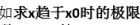 
    - 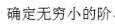
    - 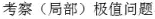
    - 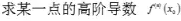
- 
  - 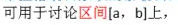
  - 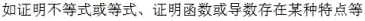

##### B 常用函数带有佩亚诺余项的麦克劳林展开式 <u>记忆方法</u> ：

- 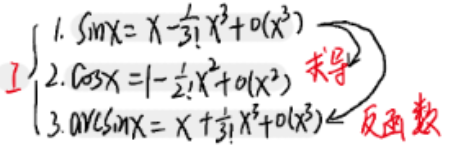
- 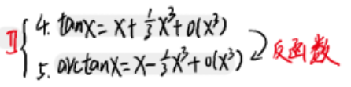
- 
- 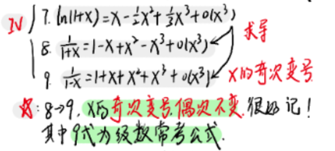
- 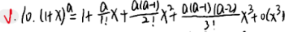
  - 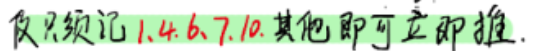
  - 

- Ⅰ：
  - $\sin x$
    - $\cos x$ 
  - $\arcsin x$
- Ⅱ：
  - $\tan x$
  - $\arctan x$
- Ⅲ：
  - $e^x$
  - $\ln(1+x)$
    - $\frac{1}{1+x}$
    - $\frac{1}{1-x}$
- Ⅳ：
  - $(1+x)^a=1+ax+\frac{\alpha(\alpha-1)}{2!}x^2+O(x^2)$
  
### $\color{grey}{2}$ $\bf\color{lightblue}解题$
> 分式上下同阶原则、加减幂次最低原则

? 应用时怎么判断展开到什么程度（二阶还是三阶？）← 精度确定
#### 分式：上下同阶原则
- 
  - 
  - 
    - 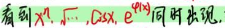
      - 
    - 
      - 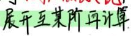
  - 
    - 
      - 
  

- **具体精度确定方法：**
   - 0._先 观察，分子、分母 哪个更易确定 最高次项 ← 定上下展开到什么程度 ← 不会只适用于，分子 分母 一个可以化为$x^m$(m确定)的情况吗，如果是待定未知数b，还是不知道如何展开到第几项啊。
     - 要不然就尝试粗暴的2、3、4都展开
  -  1._再局部观察结构，按次展开

#### 加减：幂次最低原则
- 
- 后续运算中，归属于($o(x^m)$)更大次方的(即$n>m$ )，全都可以忽略，极限均为0
- q:eg1.1
  - 
  - 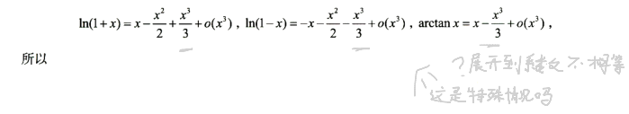
  - 这个不符合啊？

附：佩亚诺余项公式完整

$$e^x=1+x+\frac{1}{2!}x^2+\cdots +\frac{1}{n!}x^n+O(x^n)$$

$$\ln(1+x)=x-\frac{1}{2}x^2+\frac{1}{3}x^3+\cdots +\frac{(-1)^n}{n+1}x^{n+1}+O(x^n)$$

$$(1+x)^a=1+ax+\frac{\alpha(\alpha-1)}{2!}x^2+\cdots +\frac{\alpha(\alpha-1)\cdots (\alpha-n+1)}{n!}x^n+O(x^n)$$

$$\frac{1}{1-x}=1+x+x^2+x^3+\cdots +x^n+O(x^n)$$

$$\frac{1}{1+x}=1-x+x^2-x^3+\cdots +(-1)^nx^n+O(x^n)$$

$$\sin x=x-\frac{1}{3!}x^3+\frac{1}{5!}x^5+\cdots +\frac{(-1)^n}{(2n+1)!}x^{2n+1}+O(x^{2n+1})$$

$$\arcsin x=x+\frac{1}{6}x^3+\cdots +\frac{(2n)!}{4^n(n!)^2(2n+1)}x^{2n+1}+O(x^{2n+1})$$

$$\tan x=x+\frac{1}{3}x^3+\frac{2}{15}x^5+\cdots +\frac{B_{2n}(-4)^n(1-4^n)}{(2n)!}x^{2n-1}+O(x^{2n-1})$$

$$\arctan x=x-\frac{1}{3}x^3+\frac{1}{5}x^5+\cdots +\frac{(-1)^n}{2n+1}x^{2n+1}+O(x^{2n+1})$$

$$\cos x=1-\frac{1}{2!}x^2+\frac{1}{4!}x^4+\cdots +\frac{(-1)^n}{(2n)!}x^{2n}+O(x^{2n})$$

$\color{grey}注：tanx$

\[
\tan(x) = \sum_{n=0}^{\infty} \frac{B_{2n}}{(2n)!} (4^n - 1) x^{2n+1}
\]
其中，$B_{2n}$ 是第 $2n$ 个伯努利数。这个级数只在 $-\frac{\pi}{2} < x < \frac{\pi}{2}$ 的范围内收敛。
- 伯努利数 $B_{2n}$ 定义为：
\[
\frac{z}{e^z - 1} = \sum_{n=0}^{\infty} \frac{B_n}{n!} z^n
\]
- 对于 $n=0,1,2,\ldots$，伯努利数 $B_n$ 可以通过以下递推关系计算：
\[
B_n = -n \sum_{k=0}^{n-1} \frac{B_k}{k+1}
\]
其中 $B_0 = 1$。这样，我们可以计算出前几个伯努利数：
\[
B_0 = 1, \quad B_1 = -\frac{1}{2}, \quad B_2 = \frac{1}{6}, \quad B_4 = -\frac{1}{30}, \quad B_6 = \frac{1}{42}, \quad \ldots
\]
因此，$\tan(x)$ 的泰勒展开式可以写为：
\[
\tan(x) = x + \frac{1}{3} x^3 + \frac{2}{15} x^5 + \frac{17}{315} x^7 + \frac{62}{2835} x^9 + \ldots
\]
这个级数在 $-\frac{\pi}{2} < x < \frac{\pi}{2}$ 范围内收敛到 $\tan(x)$。

附：技巧与定义的参考文章
[text](https://blog.csdn.net/yuxuezhang/article/details/123430850?spm=1001.2014.3001.5502)←csdn
[text](https://www.jianshu.com/p/4fc6d3c264aa)←简书
张宇18讲